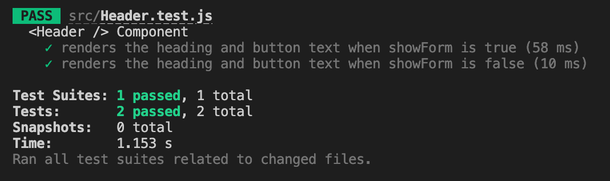
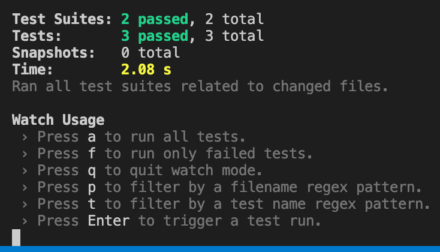
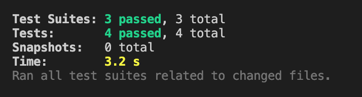
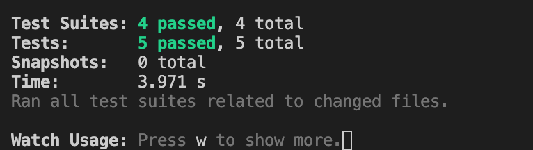
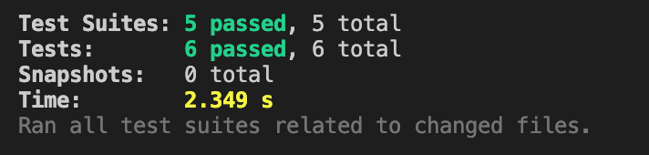

# Activity 0 - Setup

### Instructions

0. Start by creating a new folder named Lab 13 to organize all the files for this lab.
1. Inside the lab13 folder, initialize a new React project: npx create-react-app .
2. Navigate to the folder and open it in a code editor.
3. Install testing library using `npm install --save-dev @testing-library/react @testing-library/jest-dom`
4. DO the ACTIVITIES

# Activity 1 – ByRole

### Instructions

1. Create a file named Header.js. Add the following code:

```javascript
// Header.js
import React from 'react';
import PropTypes from 'prop-types';

const Header = ({ name, showForm }) => {
  return (
    <header>
      <h1>{name}</h1>
      {showForm ? (
        <button>Close</button>
      ) : (
        <button>Add Task</button>
      )}
    </header>
  );
};

Header.propTypes = {
  name: PropTypes.string.isRequired,
  showForm: PropTypes.bool.isRequired,
};

export default Header;
```

2. Write unit test: Create a file named Header.test.js. Add the following code:

```javascript
// Header.test.js
import { render, screen } from '@testing-library/react';
import Header from './Header';

describe('<Header /> Component', () => {
  test('renders the heading and button text when showForm is true', () => {
    render(<Header name="Task Manager" showForm={true} />);

    const heading = screen.getByRole('heading', { name: 'Task Manager' });
    expect(heading).toBeInTheDocument();

    const closeButton = screen.getByRole('button', { name: 'Close' });
    expect(closeButton).toBeInTheDocument();

    const addTaskButton = screen.queryByRole('button', { name: 'Add Task' });
    expect(addTaskButton).not.toBeInTheDocument();
  });

  test('renders the heading and button text when showForm is false', () => {
    render(<Header name="Task Manager" showForm={false} />);

    const heading = screen.getByRole('heading', { name: 'Task Manager' });
    expect(heading).toBeInTheDocument();

    const addTaskButton = screen.getByRole('button', { name: 'Add Task' });
    expect(addTaskButton).toBeInTheDocument();

    const closeButton = screen.queryByRole('button', { name: 'Close' });
    expect(closeButton).not.toBeInTheDocument();
  });
});

```

3. Run the test: `npm test`

### Output



# Activity 2 – Find Multiple Elements

### Instructions

1. Install necessary dependencies: `npm install react-router-dom @testing-library/react @testing-library/jest-dom`

2. Create a file Navigation.js. Add the following code:

```javascript
// Navigation.js
import React from 'react';
import { Link } from 'react-router-dom';

const Navigation = () => {
  return (
    <nav>
      <ul>
        <li>
          <Link to="/home">Home</Link>
        </li>
        <li>
          <Link to="/about">About</Link>
        </li>
        <li>
          <Link to="/contact">Contact</Link>
        </li>
      </ul>
    </nav>
  );
};

export default Navigation;
```

3. Create a test file Navigation.test.js:
```javascript
// Navigation.test.js
import { render, screen } from '@testing-library/react';
import { MemoryRouter } from 'react-router-dom';
import Navigation from './Navigation';

describe('<Navigation />', () => {
  test('renders 3 links', () => {
    render(
      <MemoryRouter>
        <Navigation />
      </MemoryRouter>
    );

    const links = screen.getAllByRole('link');

    expect(links).toHaveLength(3);
  });
});

```


4. Run the tests: ```npm test```. Ensure that all tests pass with an output similar to the image.

### Output




# Activity 3 – Interacting with Elements

1. Create a file AddTask.js. Add the following code:

```javascript
// AddTask.js
import React, { useState } from 'react';

const AddTask = () => {
  const [task, setTask] = useState('');

  const handleChange = (event) => {
    setTask(event.target.value);
  };

  return (
    <div>
      <label htmlFor="task-input">Task</label>
      <input
        id="task-input"
        type="text"
        value={task}
        onChange={handleChange}
        placeholder="Enter a task"
      />
      <p>Current task: {task}</p>
    </div>
  );
};

export default AddTask;

```

2. Create a test file AddTask.test.js:
```javascript
// AddTask.test.js
import { render, screen } from '@testing-library/react';
import userEvent from '@testing-library/user-event';
import AddTask from './AddTask';

describe('<AddTask /> Component', () => {
  test('updates input value as user types', async () => {
    render(<AddTask />);

    const input = screen.getByLabelText(/task/i);

    const userInput = 'Buy groceries';
    await userEvent.type(input, userInput);

    expect(input.value).toBe(userInput);

    const displayedTask = screen.getByText(`Current task: ${userInput}`);
    expect(displayedTask).toBeInTheDocument();
  });
});
```

3. Run the tests: ```npm test```. Ensure that all tests pass with an output similar to the image.

### Output




# Activity 4 – Testing callback handlers

### Instructions

1. Create a file MockHeader.js. Add the following code:

```javascript
// MockHeader.js
import React from 'react';
import PropTypes from 'prop-types';

const Header = ({ name, showForm, onAddClick }) => {
  return (
    <header>
      <h1>{name}</h1>
      <button onClick={onAddClick}>
        {showForm ? 'Close' : 'Add Task'}
      </button>
    </header>
  );
};

Header.propTypes = {
  name: PropTypes.string.isRequired,
  showForm: PropTypes.bool.isRequired,
  onAddClick: PropTypes.func.isRequired,
};

export default Header;

```

2. Create a test file MockHeader.test.js:
```javascript
// MockHeader.test.js
import { render, screen } from '@testing-library/react';
import userEvent from '@testing-library/user-event';
import MockHeader from './MockHeader';

describe('<Header />', () => {
  test('calls onAddClick when the button is clicked', async () => {
    // Create a mock function using jest.fn()
    const mockOnAddClick = jest.fn();

    // Render the component with the mock function
    render(
      <MockHeader name="Task Manager" showForm={false} onAddClick={mockOnAddClick} />
    );

    // Find the button
    const button = screen.getByRole('button', { name: /Add Task/i });

    // Simulate a user click on the button
    await userEvent.click(button);

    // Assert that the mock function is called
    expect(mockOnAddClick).toHaveBeenCalled();
  });
});
```

3. Run the tests: ```npm test```. Ensure that all tests pass with an output similar to the image.

### Output




# Activity 5 – Integration Test

### Instructions

1. Add the following code in App.js:

```javascript
// App.js
import React, { useState } from "react";
import AddTask from "./AddTask";
import MockHeader from "./MockHeader";
import Navigation from "./Navigation";

const App = () => {
  const [showForm, setShowForm] = useState(false);
  const handleAddClick = () => {
    setShowForm((prev) => !prev);
  };

  return (
    <div>
      <Navigation />
      <MockHeader
        name="Task Manager"
        showForm={showForm}
        onAddClick={handleAddClick}
      />
      {showForm && <AddTask />}
    </div>
  );
};

export default App;


```

2. Add the following code in App.test.js:
```javascript
// App.test.js
import { render, screen } from '@testing-library/react';
import userEvent from '@testing-library/user-event';
import { MemoryRouter } from 'react-router-dom';
import App from './App';

jest.mock('@auth0/auth0-react', () => ({
  Auth0Provider: ({ children }) => children,
  useAuth0: () => ({
    isLoading: false,
  }),
}));

describe('<App /> Integration Test', () => {
  test('renders navigation, header, and toggles the AddTask form', async () => {
    render(
      <MemoryRouter>
        <App />
      </MemoryRouter>
    );

    // Assert Navigation links are rendered
    const links = screen.getAllByRole('link');
    expect(links).toHaveLength(3);

    // Assert Header button is present
    const addButton = screen.getByRole('button', { name: /Add Task/i });
    expect(addButton).toBeInTheDocument();

    // Assert AddTask form is NOT visible initially
    const formInput = screen.queryByPlaceholderText('Enter a task');
    expect(formInput).not.toBeInTheDocument();

    // Click "Add Task" button
    await userEvent.click(addButton);

    // Assert AddTask form becomes visible
    const formInputVisible = screen.getByPlaceholderText('Enter a task');
    expect(formInputVisible).toBeInTheDocument();

    // Click "Close" button
    const closeButton = screen.getByRole('button', { name: /Close/i });
    await userEvent.click(closeButton);

    // Assert AddTask form is hidden again
    const formInputHidden = screen.queryByPlaceholderText('Enter a task');
    expect(formInputHidden).not.toBeInTheDocument();
  });
});

```

3. Add the following code in index.js:
```javascript
// index.js
import React from 'react';
import ReactDOM from 'react-dom';
import { BrowserRouter } from 'react-router-dom';
import App from './App';

ReactDOM.render(
  <React.StrictMode>
    <BrowserRouter>
      <App />
    </BrowserRouter>
  </React.StrictMode>,
  document.getElementById('root')
);

```

4. Run the tests: ```npm test```. Ensure that all tests pass with an output similar to the image.

### Output



